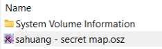
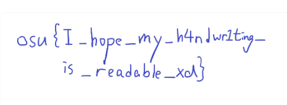

import Chall from "@/components/externals/Chall.astro"

## Free-rensics

## Preliminary
This category has a single challenge this year.

It was marked a `3/5` difficulty-wise, but the moment you figure out where to look the challenge immediately becomes `0/5`, therefore the `free-rensics`. I guess the challenge author's solution was the "unintended" one, after all.

## The Challenge
### forensics/map-dealer

<Chall
  title="Map Dealer"
  authors={["hollow"]}
  category="forensics"
  files={["forensics_map-dealer.tar.gz"]}
  solvedInTime="no"
  flag="osu{I_hope_my_h4ndwr1ting_is_readable_xd}"
>
  We have confiscated a USB drive from sahuang, whom we were informed was trying to sell a beatmap containing some confidential data of the community to the dark web. However, the beatmap was nowhere to be found from the drive when we mounted it to our computer. Can you help recover it?
</Chall>

The challenge archive contains a single `.E01` file. The problem is, if we pick the wrong program to open or try to mount this image to our drive, nothing appears. That's the intended part.

Now the unintended part, most likely, because there would be absolutely no way this challenge would be rated `3/5` otherwise: Open that image file in `FTKImager`.

Lo and behold, the map is right there:

Just open the `.osz` file in `osu!`.

Free-rensics. Unfortunately I didn't pay attention. My bad.
