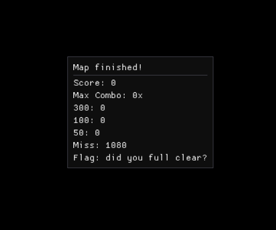
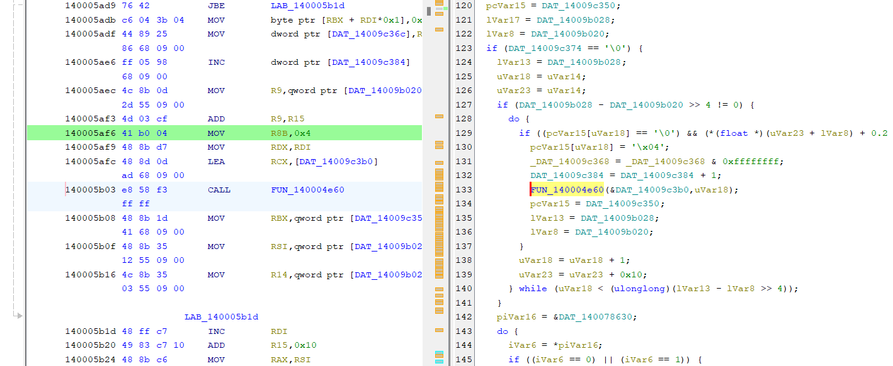
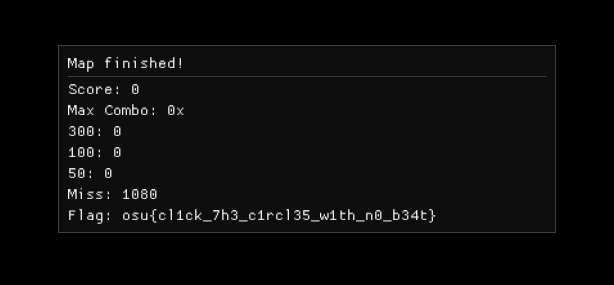

import Chall from "@/components/externals/Chall.astro"

<div class="invisible h-0!">
## Reverse
</div>
## Preliminary
I'm an absolute beginner at reverse engineering CTFs, either because I don't have the motivation to chew through the extensive world of decompilers and Assembly and dynamic analysis and whatnot or because I'm really lazy to do a ton of code analysis.

`es3n1n` arguably wrote the *most* beautiful challenges of the entire contest this time around. Aside from other really, really good `web` challenges, this category actually has the reverse spirit all around.

Though, unfortunately I could only solve one myself. One has a bug (is that even a bug?), the other is probably one of the hardest technical reverse challenges for a two-day long contest with only **8 solves** after the contest ends.

## The Challenges
### rev/bleh

<Chall
  title="bleh."
  authors={["es3n1n"]}
  category="rev"
  solvedInTime="yes"
  files={["rev_bleh.tar.gz"]}
  flag="osu{bl3h_bleh_b13h_m4n_1_l0v3_aut0_r3vs_e4fb25f}"
>
  bleh :p
</Chall>

Even though I said I solved this in time, I never ended up submitting in time just because I woke up a few hours after the contest announced its ending. I fell asleep when the solve script I wrote was doing its thing.

Another thing: there might be multiple ways to solve this challenge. In my findings I've found two ways, one that uses, to a certain degree, math, the other brute-forces the solve. The mathematical solve will be mentioned later.

Upon downloading the challenge file and extracting it, we can see there are... **3,842 files**, `bleh0...bleh3841`, lol. That's an incredible sight.

Opening some of these reveals that they do the same thing... there's just one problem. Something about them was different.

I used [Ghidra](https://github.com/NationalSecurityAgency/ghidra) to do this. Any other tool, for example BinaryNinja or IDA, probably produces the same result, maybe with differences in its pseudo-code or naming conventions.

Most inspections should be self-explanatory:
- The first 32 bytes of the string used to compare to the key is a static key, `PL4YING_CTFS_ISNTBETTER_THAN_OSU`
- The other 32 bytes are for our input
- For each `i`,
```c showLineNumbers=false
b = FUN_00101337(input[i], key[i], state)
state = (uint)b
out[i] = b
```
- Then, the output of that has to match the hardcoded target:
```c showLineNumbers=false
strncmp(out, target, 0x20) == 0
```
We need to find an `input` such that the transformed `out` bytes matches what's in the obfuscated `target` array.

The main logic is in `FUN_00101337`, as denoted, so we check there:

```c
local_c4 = FUN_001011c9(param_1, 6);
local_d4 = FUN_001011c9(param_2, 0x80);
local_e4 = FUN_00101280(param_3, 0x80);

local_78 = local_98 ^ local_a8; // local_98 = local_d4, local_a8 = local_c4
local_68 = local_e4 + (int)local_78;
return local_68;
```

That's basically doing

```c showLineNumbers=false
out = FUN_00101280(state, 0x80) + (FUN_001011c9(key, 0x80) ^ FUN_001011c9(input, 6))
```

`FUN_001011c9(uint x, int n){:c}` is doing basically `x + n`, since it's just recursive with a constant depth `param_2`. `FUN_00101280 (uint x, int n){:c}` is doing basically `x - n` for the same reason as well, so we can simplify `out` as follows:

```c showLineNumbers=false
out = (state - 128) + ((key + 128) ^ (input + 6))
```

This is the state we want to begin solving the challenge.

Let's just solve `bleh0` first initially, then check the other `bleh` files to see what these files differ. Then we can repeat the solve for all the other ones.

#### The (likely) intended solve

For a CTF contest, normally we want to solve the challenges as quickly as possible.

After the transforms, we end up with:

```c showLineNumbers=false
out = (state - 128) + ((key + 128) ^ (input + 6))
```

Notice that only the low 8 bits of `out` are used both for the output byte comparison and as the next state. So all arithmetic can be done modulo 256.

Given:

```txt showLineNumbers=false
T = target
S = state (low 8 bits)
K = key
I = input (unknown)
```

We rewrite `out`:

```c showLineNumbers=false
T = (S - 128) + ((K + 128) ^ (I + 6)) (mod 256)
```

Brute-forcing this is cheap, since we observed at each `i`, our executable checks one output byte `T[i]` produced from three things: the known key byte `K` (which is `key[i]`), the state `S` with an initial low byte of `0x1337 & 0xff`, and the unknown `I`. We can just check all 256 possible `I`s and see which one produces `T[i]`. There is exactly one candidate for every byte, so worst case scenario we only have to do `8192 = 256 * 32` transform evals.

This is easily implemented in Python:

```py
def fa(x, n):
  # this is FUN_001011c9
  return (x + n) & 0xffffffff

def fb(x, n):
  # this is FUN_00101280
  return (x - n) & 0xffffffff

def transf(i, k, s):
  # simulate FUN_00101337, observe that caller uses low byte of return
  return (fb(s, 128) + (fa(k, 128) ^ fa(i, 6))) & 0xffffffff

def main():
  key = b"PL4YING_CTFS_ISNTBETTER_THAN_OSU"
  # target bytes from disasm
  t_signed = [
    0x73, -0x6d, -0xf, 0x58, 0x7d, -0x61, -0x35, 0x34,
    -0x57, 0x0b, 0x7c, -0x1f, 0x46, 0x74, -0x23, 0x4f,
    -0x43, 0x3a, -0x47, 0x21, -0x7d, -10, 0x5a, -0x3e,
    0x24, -0x5d, 0x1a, -0x6d, -4, 0x75, -0x1c, 0x47
  ]
  target = [(x + 256) % 256 for x in t_signed]

  s = 0x1337 & 0xff
  f = []

  for i in range(32):
    t = target[i]
    k = key[i]
    cand = None
    for c in range(256):
      o = transf(c, k, s) & 0xff
      if o == t:
        cand = c
        break
    if cand is None:
      raise RuntimeError(f"no cand for i={i}")
    f.append(cand)
    s = t  # next state becomes the output byte (low 8 bits)

  out = "".join(f"{b:02x}" for b in f)
  print("brute'd hex:", out)
  print("raw bytes:", bytes(f))

if __name__ == "__main__":
  main()
```

Sample run succeeds:

```txt showLineNumbers=false
brute'd hex: 6666643866666530303031303461343634393436303030313031303130303630
raw bytes: b'ffd8ffe000104a464946000101010060'
```

Pass the raw bytes to the executable:

```bash
$ ./bleh0
ffd8ffe000104a464946000101010060
Nicely done
```

Of course, this approach has caveats. I've only tried this after doing the challenge by some maths, this is the simplest form of this method I've came up with.

#### The practical solve

I had time, and I was soloing this CTF as a first-timer so I was willing to sit there and do this. I'm not sure if this or the brute-force was the intended solve, but oh well.

Throwback to our `out`:

```c showLineNumbers=false
out = (state - 128) + ((key + 128) ^ (input + 6))
```

About the low 8 bits, we can observe that caller stores `b` into a byte array and sets `state = (uint)b`. That means only the low 8 bits of `out` matter for both the output byte comparison and the next state's value. As follows, we can do all math modulo 256.

Again, given:

```txt showLineNumbers=false
T = target
S = state (low 8 bits)
K = key
I = input (unknown)
```

We rewrite `out`:

```c showLineNumbers=false
T = (S - 128) + ((K + 128) ^ (I + 6)) (mod 256)
```

We're solving for `I`, so let's rearrange:

```c showLineNumbers=false
Z = T - (S - 128) (mod 256),
  with Z = (K + 128) ^ (I + 6)

I = ((K + 128) ^ Z) - 6 (mod 256)
```

With that, for each byte `i` we:
- From `T` and `S`, find `R`
- Compute `I = ((K + 128) ^ Z) - 6` (mod 256)
- Set `S = T`, then continue.

Every `I` is deterministic since we know the key and target. Let's try the first byte.

```c showLineNumbers=false
S = 0x37
K = 0x50
T = 0x73

R = T - (S - 128) (mod 256) = 0xBC

I + 6 = (K + 128) ^ R
K + 128 = 0xD0
(K + 128) ^ R = 0x6C

I = 0x6C - 6 = 0x66
```

`0x66` is `f` in `ASCII`. If you do this across all bytes you get the full input hex, but let's not do this by hand. Implementing this in Python is way simpler:

```py
key = b"PL4YING_CTFS_ISNTBETTER_THAN_OSU"

t_signed = [
  0x73, -0x6d, -0xf, 0x58, 0x7d, -0x61, -0x35, 0x34,
  -0x57, 0x0b, 0x7c, -0x1f, 0x46, 0x74, -0x23, 0x4f,
  -0x43, 0x3a, -0x47, 0x21, -0x7d, -10, 0x5a, -0x3e,
  0x24, -0x5d, 0x1a, -0x6d, -4, 0x75, -0x1c, 0x47
]

# convert signed entries to 0..255 bytes
target = bytes([(x + 256) % 256 for x in t_signed])

def byte_mod(x): return x & 0xff

S = 0x1337 & 0xff
f = []

for i in range(32):
  T = target[i]
  K = key[i]
  # R = T - (S - 128) (mod 256)
  R = byte_mod(T - (S - 128))
  I = byte_mod(((K + 128) ^ R) - 6)
  f.append(I)
  S = T

# results
out = "".join(f"{b:02x}" for b in f)
print("hex:", out)
print("raw bytes:", bytes(f))
```

We get the same thing as `brute'd` on `bleh0`:

```txt showLineNumbers=false
hex: 6666643866666530303031303461343634393436303030313031303130303630
raw bytes: b'ffd8ffe000104a464946000101010060'
```

Coincidentally that's also the start of a JPEG/JFIF header, seeing `4a464946`. From that, we can infer the other 3,841 files probably are parts of the big picture. They do the same thing, just with a different obfuscated target array.

Do the same thing for those files (and probably don't do this manually, lol), concatenate and decode as hex just as the flag intended, you'll find the image. A funny image at that.


There's the flag. This challenge is solved.

### rev/tosu-1

<Chall
  title="tosu #1"
  authors={["es3n1n"]}
  category="rev"
  solvedInTime="no"
  files={["rev_tosu-1.tar.gz"]}
  flag="osu{cl1ck_7h3_c1rcl35_w1th_n0_b34t}"
>
  Welcome to the first part of the series of tosu challenges.

  Full clear the attached map scoring only 300s.
</Chall>

From `bleh :p` to this. Amazing stuff, difficulty `3/5`.

This challenge is mainly just observe and think, not much coding is involved. Most of the solving process outlined here is actually just my thinking process, there's literally no math in here, so I'll not show a lot of decomp. code.

Now, the solve for this challenge is incredibly funny, and the inspection process is also amazingly peak content. Upon opening the challenge archive, we can see a Windows executable file `tosu.exe` and a map file `chal1.map`.

Run `tosu.exe` in CLI, supply the map as an argument. Lo and behold, impossible osu! gameplay.



Initially what comes to mind before one begins to solve this challenge is either:
- Do something to full clear the map, as in, full 300 it, whatever means possible,
- Or just patch the executable to ignore the hit results.

Upon inspections, we can see the challenge works by having a **hasher** that gets updated throughout the process of us sitting there and watch the circles appear and disappear (ultimate yap), and it works like this:
- *On challenge start*: The hash is updated using all objects and difficulty settings.
- *On any hit or miss action*: The hash is updated using that hit result and the object index (there might be something else, but we don't care)
- *On challenge end*: The hash is updated using whatever stats will be shown on the screen and all the objects once again.

That hash is then used to decrypt the flag. The obvious solution that comes to mind to get the correct hash, as per the description of this challenge, is to full clear the map. Somehow.

But, being one lucky person who went to `rev` only after `es3n1n` updated the description of the challenge, adding this ONE line:
```txt showLineNumbers=false
If your solver isn't working and you're confident that it seems correct but still can't get the flag, try achieving the perfect score with no reflection of it in the GUI. Essentially, you should have a perfect score without ever touching the circles, and the counts on the final screen should all be zero except the miss count, which should be 1080. (It will make sense if you're stuck in that place)
```

Then just make a miss count as 300 internally so it gets added to the hasher, right? 

Yes.

Tracing the function where hit judgements are counted and added to the hasher, this is where the miss is counted:



I think if you analyzed this on runtime with a couple tools, you'd have a much easier time finding that out. I had time after the Sunday tournament game, so there it is.

Anyway, miss is `0x4`. Patch that to `0x3`, the challenge is solved...



Post-contest, many people in different teams confessed they initially tried to make an aimbot that literally just annihilates this game, in one way or another, just to end up solving this challenge a single minute after the description edit. The description, to be fair, was misleading as hell. I'd have done the same thing if I wasn't lucky.

One experience I got from this was to stop thinking of annihilating the impossible. Thanks, `es3n1n`.

### rev/tosu-2

<Chall
  title="tosu #2"
  authors={["es3n1n"]}
  category={["rev", "crypto"]}
  solvedInTime="no"
  files={["rev_tosu-2.tar.gz"]}
  flag="osu{e5ed275c44694a8f9688065ff540e1057dfbc948}"
>
  (˶˃ ᵕ ˂˶) .ᐟ.ᐟ
</Chall>

As I mentioned, by the time the contest ends, there are **8 solves** on this challenge. I was away for the entire Sunday in my timezone, since I had a tournament game to play. There's no way I would look into this challenge...

But one thing `es3n1n` added when I came back to check the `#reverse` channel:


Yeah... no. However, a CTF team, who finished this contest at second place, has a quite detailed and nice write-up of how they solved this challenge. Give that a read, learn from the best!

Here goes: https://slight-smile.com/writeups/osu-ctf-25/#rev--tosu-2
